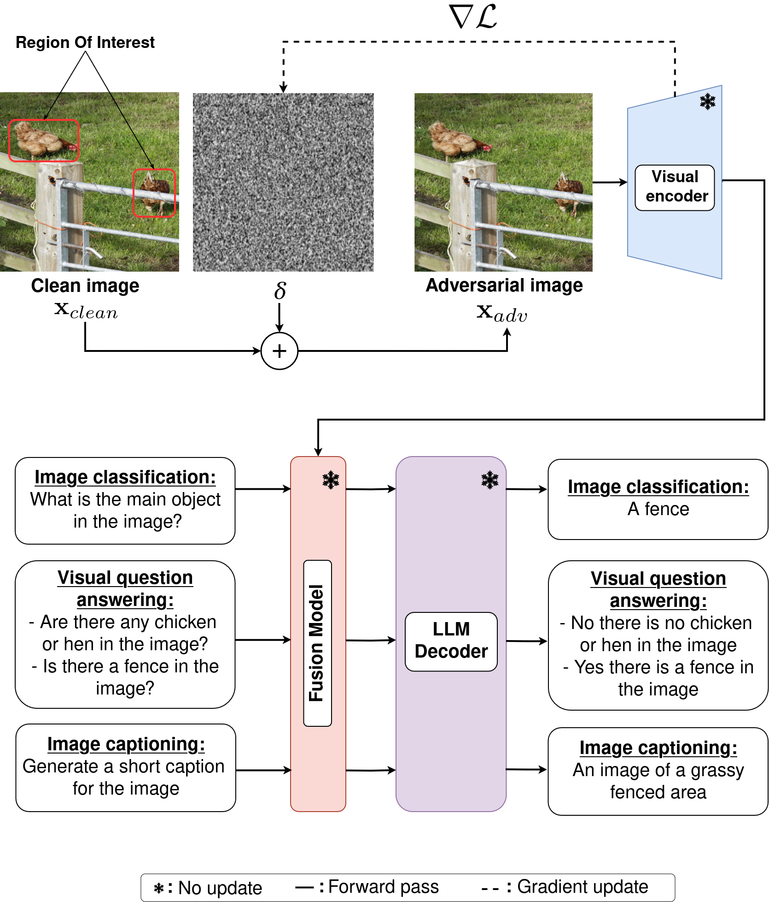

# VIP: Visual Information Protection through Adversarial Attacks on Vision-Language Models
This code provides a PyTorch implementation of the paper titled **VIP: Visual Information Protection through Adversarial Attacks on Vision-Language Models** (Full paper will be soon available at: arxiv). 

  

The figure above provides an overview of our proposed attack's framework. We separate the different VLM’s components to better illustrate our attack. 
Our attack uses only the visual encoder to compute the new attention maps and update the perturbation δ using loss gradients (loss is given by equations (3) and (4) in the paper). 
Bottom part shows expected VLM generated outputs when inferring our resulting adversarial image with different text inputs.

## Acknowledgements
  This project is funded by Région Bretagne (Brittany region), France, CREACH Labs and Direction Générale de l’Armement (DGA).
